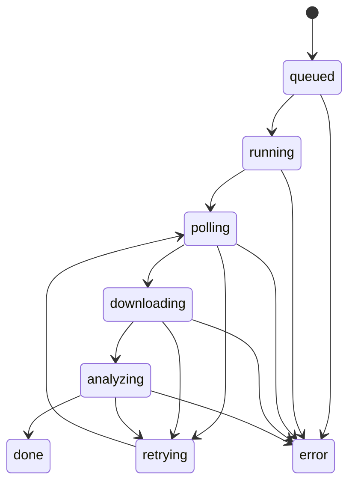

# 任务编排与媒体资产规范

本规范定义图片处理、视频生成和视频合成的可恢复任务模型，以及素材、片段和成片的存储边界。目标是让服务重启、页面刷新或用户切换工作区后，任务状态仍可追踪，媒体来源仍可解释。

## 核心原则

1. **先持久化，后轮询**：外部服务返回 `task_id` 后，先写入草稿任务记录，再进入轮询。
2. **本地资产优先**：外部下载 URL 是临时结果；成功后下载到 `output/`，后续合成只消费本地、通过预检的片段。
3. **版本不可覆盖**：同一素材的再次生成创建新版本，不覆盖历史文件或历史任务。
4. **状态可恢复**：服务启动时应识别并接管未完成任务。
5. **人工审核在环**：质量分数和自动分类只是提示，不替代发布前审核。

## 制作状态与解锁

```text
素材上传 → 图片处理 → 提示词装配 → 视频生成 → 成片合成 → 声音与文字 → 成片结果
```

每个阶段由实际产物驱动：

| 阶段 | 完成信号 | 解锁的下一阶段 |
| --- | --- | --- |
| 素材与菜品 | 输入节点有 `imagePreview` | 图片处理 |
| 图片处理 | 图片处理节点有 `processedImagePreview` | 提示词装配 |
| 提示词装配 | 提示词节点状态为“已装配” | 视频生成 |
| 视频生成 | 已选片段具备本地 `sourcePath` | 成片合成 |
| 成片合成 | 工作区无声任务状态为 `done` | 声音与文字 |
| 声音与文字 | 工作区有声任务状态为 `done` | 成片结果 |

后续步骤必须要求前面所有步骤均完成。禁止用单纯“点击了按钮”或相邻步骤状态作为解锁依据。

## 通用任务契约

`web/services/task_contract.py` 维护图片处理、Kling 生成和视频合成共用的可持久化字段。实现可以保留特有字段，但不得丢弃下列通用信息：

| 字段 | 含义 |
| --- | --- |
| `task_type` | `image_processing`、`kling_generation` 或 `video_composition` |
| `status_version` | 任务记录格式版本 |
| `status` | 当前机器可读状态 |
| `phase` | 页面可展示的阶段说明 |
| `events` | 最近状态变更记录，用于排查 |
| `retry_count` / `max_retries` | 有限重试控制 |
| `task_id` | 外部服务返回的可恢复标识（若适用） |

标准状态流：



- 图片处理通常从 `queued` 进入 `running`，完成后为 `done`。
- 视频合成通常从 `queued` 进入 `running`，完成后为 `done`。
- Kling 生成会经过 `polling`、`downloading`、`analyzing`。
- 旧记录处于 `queued` 或 `running` 时，恢复逻辑仍须兼容；新增中间状态同样应可恢复。

## 媒体资产生命周期

### 输入素材

- 菜品图、尾帧、BGM 等上传文件保存到对应草稿的 `files/` 目录。
- 素材库上传保留目录层级，存入草稿的 `asset_library_uploads/`。
- 单个上传文件限制为 50 MB；大目录应分批上传。

### 图片处理结果

- 原图不覆盖；处理后的图片单独保存并回写 `processedImagePreview`。
- 手部或厨师主体可按规则保留原图，处理结果仍应明确记录。

### 视频片段

- 真实 MP4 保存至 `output/canvas_clips/`。
- 下载后再执行本地规则分析，写入质量分数、警告、来源任务和版本信息。
- 同一素材再次生成创建 V1、V2…；仅“当前使用”的真实片段进入合成候选池。
- 未绑定生成节点的历史本地文件只可浏览，不自动进入候选池。

### 成片

- 每个合成工作区独立保存无声和有声任务及结果。
- 一个工作区失败不得覆盖其他工作区的已有结果。
- 合成前先校验片段可读性、时长、顺序和选中状态。

## 质量与人工审核

本地质量分数来自分辨率、帧率、时长、编码等规则，用于排序和预检提醒，不代表模型质量评分。自动菜品分类、提示词建议、片段推荐均必须允许人工修改。

发布前至少确认：

- 菜品内容、分类和主体类型正确
- 首帧、背景与品牌表达符合要求
- 提示词动作与菜品匹配
- 片段无明显生成瑕疵，裁剪顺序正确
- BGM、人声、文字时序与品牌文案正确

## 故障处理边界

- 缺失密钥、额度不足或服务不可用时，任务应进入可解释的错误状态，不应伪造成功结果。
- 外部 URL 失效后，不能在合成阶段重新猜测 URL；应重新下载或重新生成。
- 不要通过删除草稿或媒体文件来“修复”状态，除非已确认备份和准确目标。

## 相关文档

- [工程结构说明](工程结构说明.md)
- [运行与排障手册](运行与排障手册.md)
