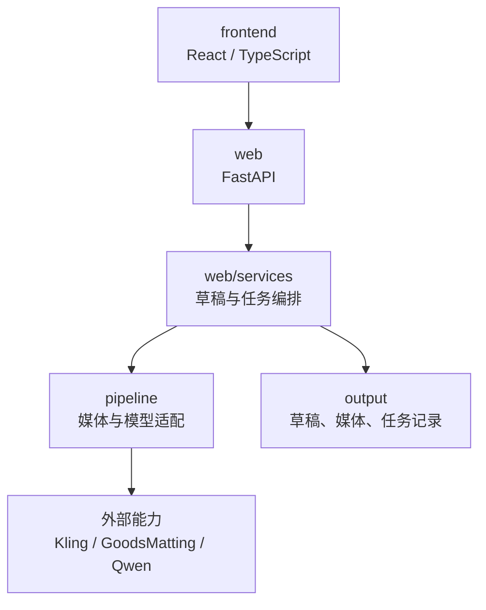

# 工程结构说明

本项目按“界面交互、应用服务、领域能力、运行数据”分层。页面不直接承担外部模型调用，领域模块也不直接依赖 HTTP；这样可以在不改变用户流程的前提下替换外部服务、恢复异步任务或扩展测试。

## 分层总览



## 目录职责

| 路径 | 职责 | 是否提交 Git |
| --- | --- | --- |
| `frontend/` | React、TypeScript、React Flow 页面、状态与前端领域测试 | 是 |
| `frontend/src/components/` | 画布节点、步骤页、编辑抽屉、任务中心等 UI 组件 | 是 |
| `frontend/src/workflowStore.ts` | 草稿状态、页面交互与 API 调用协调 | 是 |
| `web/api/` | HTTP 路由、请求校验与响应映射 | 是 |
| `web/services/` | 草稿、素材库、图片处理、生成、合成、质量检查等业务编排 | 是 |
| `web/core/` | 配置、日志与应用基础设施 | 是 |
| `pipeline/` | Kling、抠图、FFmpeg、TTS、提示词等可复用领域能力 | 是 |
| `tests/backend/` | API、服务、草稿与任务状态测试 | 是 |
| `tests/pipeline/` | 提示词、字幕、音频与媒体领域测试 | 是 |
| `scripts/` | Windows 构建/验证及 Linux 部署脚本 | 是 |
| `docs/` | 使用、架构、部署与运行规范 | 是 |
| `output/` | 草稿、上传媒体、片段、成片与任务记录 | 否 |
| `web/static/canvas-app/` | 前端构建产物，由 FastAPI 提供 | 否 |
| `logs/`、`.tmp/` | 运行日志与临时文件 | 否 |

## 前端职责与路由

`frontend/src/App.tsx` 负责路由分发、草稿加载、自动保存和页面级提示；`Pipeline.tsx` 负责左侧导航和步骤状态；`workflowProgress.ts` 根据实际产物计算制作步骤是否完成。

| 路径 | 页面职责 | 访问规则 |
| --- | --- | --- |
| `/canvas-mvp` | 查看和连接流程节点 | 始终可访问 |
| `/workflow/assets` | 上传、维护菜品素材 | 第一步，始终可访问 |
| `/workflow/image-processing` | 处理首帧、背景与主体 | 需要已上传素材 |
| `/workflow/prompts` | 配置和校验提示词 | 需要图片处理完成 |
| `/workflow/generator` | 创建与查看视频生成任务 | 需要提示词已装配 |
| `/workflow/compose` | 片段选择、裁剪、无声合成 | 需要真实片段 |
| `/workflow/sound` | BGM、人声、文字与有声合成 | 需要无声成片 |
| `/workflow/output` | 预览和下载成片 | 需要有声成片 |
| `/workflow/tasks` | 查看任务状态 | 始终可访问 |
| `/workflow/weekly-plan` | 配置周计划生产 | 始终可访问 |

步骤解锁必须检查**全部前置产物**，而不是只检查相邻的上一步。界面上的“实时装配”等动作也应在业务前置条件不足时禁用。

## 服务层与领域层的边界

### `web/api/`

- 只处理 HTTP 请求、参数校验、权限边界（如后续引入）和响应序列化。
- 不在路由函数中实现耗时轮询、文件转码或媒体算法。

### `web/services/`

- 将草稿状态、文件路径、任务记录与页面行为编排为业务流程。
- 负责把外部任务的可恢复信息写入运行数据。
- 调用 `pipeline/`，但不把 UI 状态下沉到领域模块。

### `pipeline/`

- 封装提示词装配、Kling、抠图、FFmpeg、TTS 等能力。
- 输入输出应可被服务层测试和复用；不读取浏览器状态，也不依赖 FastAPI Request 对象。

## 运行数据

```text
output/
├── background_templates/          可复用背景模板
├── canvas_clips/                  下载或导入的真实视频片段
│   ├── .previews/                 浏览器兼容预览
│   └── .thumbnails/               缩略图
├── canvas_drafts/<draft_id>/
│   ├── draft.json                 节点、连线、片段和工作区状态
│   ├── files/                     上传的菜品图、尾帧、BGM 等
│   ├── asset_library_uploads/     浏览器上传的素材库副本
│   ├── generate-*.json            可恢复的生成任务
│   └── compositions/              无声/有声成片与任务记录
└── asset_library_manual_review/   人工整理任务的扫描清单与中间状态
```

浏览器草稿 ID 用于减少不同浏览器间的误操作，不构成登录、身份认证或多租户隔离。`output/` 也是运行数据，不是备份系统。

## 开发约定

1. UI 和交互改动放在 `frontend/src/`；完成后构建到 `web/static/canvas-app/`。
2. 新业务能力优先放在 `web/services/` 或 `pipeline/`，不要把复杂流程堆入路由层。
3. 外部任务在获得 `task_id` 后必须持久化，再进入轮询阶段。
4. 不提交 `.env`、密钥、绝对素材路径、媒体成品、草稿或日志。
5. 修改行为时同步增加或调整测试；提交前运行 `scripts\verify.bat`。

## 相关文档

- [任务编排与媒体资产规范](任务编排与媒体资产规范.md)
- [运行与排障手册](运行与排障手册.md)
- [CI/CD 部署说明](CI-CD部署说明.md)
